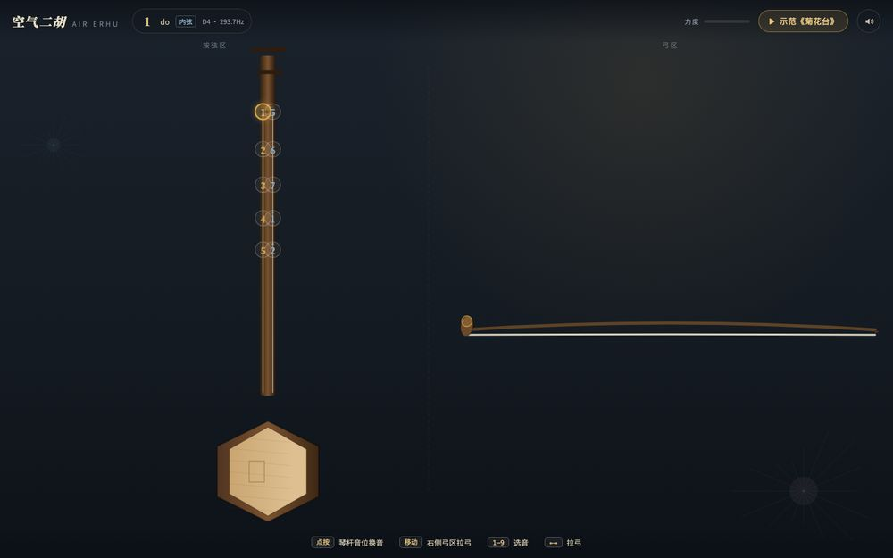

# 空气二胡 · Air Erhu

鼠标即琴弓的网页二胡——不会拉二胡，也能在浏览器里像模像样地拉一曲。

这是本地可直接运行的交互网页原型：不会二胡的人也可以用鼠标推拉弓、用数字键按音位，在浏览器里体验空气二胡。

## 这是什么

一个**单文件自包含**的交互网页（`index.html`，零依赖）。画面就是一把二胡：



- **左侧 · 琴杆（按弦区）**：竖直琴杆上排布 D 调第一把位音位（内弦 1 2 3 4 5、外弦 5 6 7 i 2'），点按即按弦；琴杆上有随音位上下移动的左手按弦示意，当前按弦手指会高亮。
- **右侧 · 弓区**：横向琴弓跟随鼠标左右滑动，移动越快声音越亮越大，像真的拉弓。
- **内置示范**：《菊花台》二胡谱版本旋律示范，按用户提供的谱面重写主歌、副歌、休止符与高音，播放时弓法与指法自动演示。

## 在线体验

本仓库已启用 GitHub Pages，直接访问：

**https://zcxzju.github.io/air-erhu/**

本地运行：直接双击打开 `index.html`，或用任意静态服务器：

```bash
python3 -m http.server 8080
# 打开 http://localhost:8080
```

## 玩法

| 操作 | 效果 |
| --- | --- |
| 点击「进入演奏」 | 解锁声音（浏览器要求用户手势后才允许发声） |
| 点按琴杆上的音位 | 按弦换音（初始为空弦内弦 1） |
| 在右侧弓区左右移动鼠标 | 拉弓发声，移动速度 = 力度/亮度 |
| 键盘 1–7 | 按固定音阶选音：1=do、2=re、3=mi、4=fa、5=sol、6=la、7=si |
| 键盘 ← / → | 模拟拉弓 |
| 右上角静音开关 | 静音，偏好记忆在本地 |

## 技术要点

- 纯原生 HTML / Canvas / Web Audio，无任何外部依赖（仅字体走自托管镜像）。
- 二胡音色合成：弓激发的锯齿波/三角波弦振动、低频琴筒共鸣、低通滤波随弓速/弓压开合、首次碰弓约 100ms 的 onset scratch、弓压驱动的弓毛摩擦与气声层、宽且不规则的揉弦、每个音符的上滑音、自然收音但不在尾音处降调滑落、±12 半音 Pitch Bend、短房间混响与轻微延迟；避免使用人声共振峰。
- 示范曲以 `audioContext.currentTime` 为唯一时钟调度，音画同步；弓法按谱面短语交替推弓/拉弓，休止符不发声，长音拆弓。
- 空闲时不启动可听见的音量调制：揉弦 LFO 不再直接调制 0 增益，避免进入页面后出现底噪。
- 二胡定弦 D4–A4（D 调，1-5 弦）：内弦空弦 = 1，外弦空弦 = 5。

## 示范曲旋律来源

《菊花台》（周杰伦曲）以用户提供的二胡谱为主要依据，并参考公开数字谱的主歌/副歌音符结构，转写至 D 调二胡把位。仅作学习与演示用途，版权归原权利人所有。

## 兼容性

- 桌面端 Chrome / Edge / Safari / Firefox 均可。
- 移动端支持点按选音与触摸拉弓；iPhone 需关闭侧边静音键（页面会提示）。
- `?preview` 参数可跳过开始浮层（不自动发声），便于截图预览。
