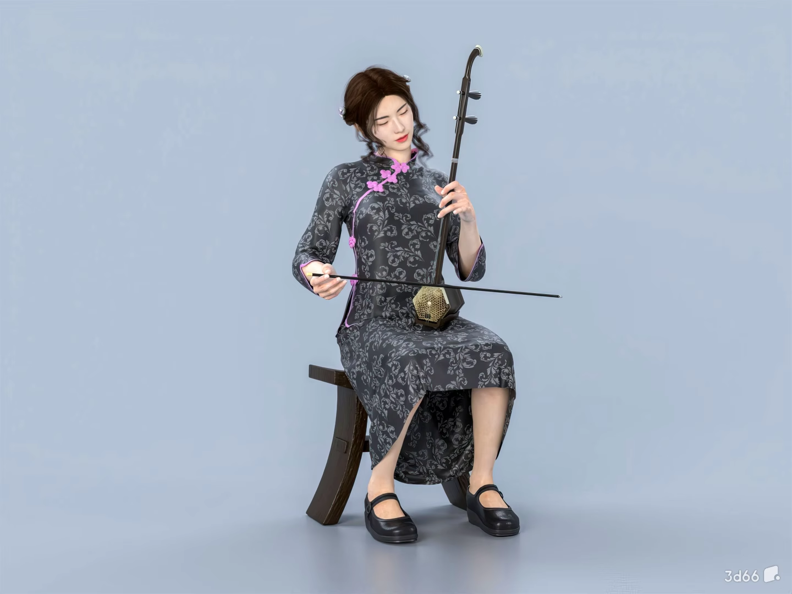

# 空气二胡 · Air Erhu

一个可以直接在浏览器里演奏的互动二胡页面：女生 3D 演奏模型负责呈现演奏场景，键盘数字键切换音高，方向键推动或拉动弓，Web Audio 合成二胡声音。

<p align="center">
  
</p>

## 在线体验

- [打开女生 3D 演奏页面](https://zcxzju.github.io/air-erhu/)
- [打开旧版单二胡页面](https://zcxzju.github.io/air-erhu/classic.html)

旧版单二胡页面仍然保留，方便继续使用原来的单琴演示和交互。

## 当前操作

| 操作 | 功能 |
| --- | --- |
| 数字键 `1`–`8` | 依次切换 `do re mi fa sol la si do` |
| 方向键 `←` | 推弓 |
| 方向键 `→` | 拉弓 |
| 鼠标或触摸拖动 | 在页面中控制弓的移动并发声 |

空弦音不需要按弦；切换到其他音位时，页面保留二胡左手按弦的演奏逻辑。声音需要先经过一次用户操作才能被浏览器解锁。

## 页面内容

- **女生 3D 演奏场景**：使用 Three.js 加载带骨骼的 `assets/rigged-woman.glb`，展示人物、二胡和弓的演奏姿态。
- **推弓 / 拉弓**：弓的运动方向和速度会影响声音的力度与音色。
- **逐关节联动**：右臂和肘部跟随推弓/拉弓动作，左手的掌指骨链随音位按弦变化；空弦时不按弦。
- **数字音高控制**：数字键与页面底部提示同步显示当前唱名。
- **声音合成**：使用 Web Audio API 合成二胡音色，并保留自然起音、揉弦和共鸣效果。
- **加载兜底**：3D 模型加载期间先显示演奏示意图，模型加载完成后自动替换，避免页面空白。

## 本地运行

由于 3D 模型通过 GLTFLoader 加载，建议使用静态服务器运行：

```bash
python3 -m http.server 8080
```

然后打开 <http://localhost:8080/>。

## 技术说明

- 页面入口：`index.html`
- 3D 渲染：Three.js + GLTFLoader
- 模型资源：`assets/rigged-woman.glb`（103 根骨骼、24 个动画片段）
- 加载示意图：`assets/erhu-player.png`
- 声音：原生 Web Audio API
- 旧版页面：`classic.html`
- 模型授权：`assets/rigged-woman-license.txt`（CC0 1.0）

当前女生页面已经替换为带骨骼和动画的 GLB；手臂、肘部、手腕和手指均通过模型骨骼驱动，不再使用悬空的程序化手型。

## 项目来源

《菊花台》示范旋律仅用于学习和交互演示，相关音乐版权归原权利人所有。
